# CLOWNHOUSE.IO // Software Laboratory

> A [studio2201](https://studio2201.github.io) work.

Welcome to **clownhouse.io** — the personal software laboratory, sovereign agentic systems testbed, and underground audio frequency outpost of **Jeryd** ([@UberMetroid](https://github.com/UberMetroid)).

Engineered with the minimalist editorial aesthetic, high-contrast typography, and responsive card layouts of [omarchy.org](https://omarchy.org).

---

## 🏛️ Core Projects

- **[openOODA.org](https://openooda.org)** — *Autonomous Agentic Architecture & Sovereign Systems Language*  
  A capability-secure systems language (`&NetCap`, `&TcpCap`, `&FsCap`) and deterministic runtime built for autonomous AI agents. Deterministic Observe-Orient-Decide-Act loops with zero ambient authority.

- **[necrometer.dev](https://necrometer.dev)** — *Developer Telemetry, Metrics & Observability Matrix*  
  Zero-server codebase mortality instrument powered by a custom Rust engine compiled directly to WebAssembly (`necrometer_bg.wasm`). Exhumes GitHub decay, PR stagnation, and carves automated SVG badges.

- **[bumtrips.com](https://bumtrips.com)** — *Beatniks, Bumtrips & Bullshit — Underground Audio & Counter-Culture*  
  Over 226 transmissions of binaural field audio, analog drones, consciousness research, and counter-culture literature field-recorded across North Africa, Cairo, and beyond.

---

## 🎪 Cluster Services & Labs

- **[reactle.clownhouse.io](https://reactle.clownhouse.io)** — Retro 1980s daily cryptic word puzzle game.
- **[giggle.clownhouse.io](https://giggle.clownhouse.io)** — Privacy-respecting SearXNG metasearch compute node (zero trackers, unbiased aggregation).
- **[jeryd@clownhouse.io](mailto:jeryd@clownhouse.io)** — Direct cryptographic inbound mail line routed through Cloudflare Anycast Edge.

---

## 🎨 Omarchy Theme Engine

clownhouse.io features 7 bespoke color palettes extracted directly from Omarchy design tokens:

| Theme | Type | Background | Accent | Description |
|---|---|---|---|---|
| **Tokyo Night** | Dark | `#1a1b26` | `#9ece6a` | Default neon-infused dark terminal palette |
| **Catppuccin** | Dark | `#1e1e2e` | `#89b4fa` | Soothing mocha pastel dark theme |
| **Gruvbox** | Dark | `#282828` | `#7daea3` | Warm retro groove with earthy contrast |
| **Nord** | Dark | `#2e3440` | `#81a1c1` | Arctic, north-bluish clean aesthetic |
| **Rosé Pine** | Light | `#faf4ed` | `#56949f` | Warm paper light mode with pine accents |
| **Ethereal** | Dark | `#060b1e` | `#7d82d9` | Deep cosmic indigo with amber highlights |
| **Vantablack** | Dark | `#000000` | `#8d8d8d` | Pure pitch-black OLED monochrome |

### Keyboard Shortcuts
- **`T`** — Cycle through all 7 theme palettes in real time (persisted in `localStorage`).
- **`⌘K` / `Ctrl+K`** or **`/`** — Open the Command Palette to search projects, services, and actions.

---

## 🚀 Architecture & Deployment

- **Pure Static Stack**: 100% Vanilla HTML5, CSS3, and ES6 JavaScript. Zero build tools, zero external runtime dependencies.
- **Zero Binary Audio Assets**: Procedural client-side Web Audio API synthesis for ambient frequency generation.
- **Hosting**: GitHub Pages deployed from branch `main` at root `/` behind Cloudflare Anycast Edge proxy.

---

&copy; 2026 CLOWNHOUSE.IO // Studio 2201 — Built by Jeryd.

---

